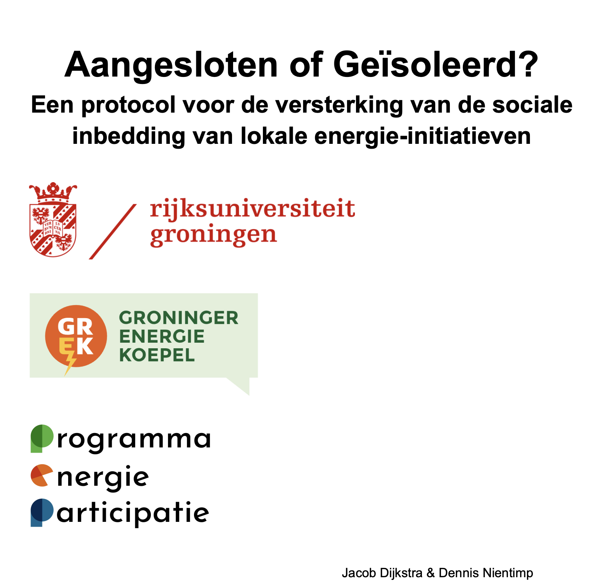

# **Aangesloten of Geïsoleerd?** 

In this protocol we elaborate the methods and insights of a networked co-creation project which [Jacob Dijkstra](https://www.rug.nl/staff/j.dijkstra/) and I conducted with [GrEK](https://grek.nl/). You can find a short article on the [PEP website](https://pepg.nl/project/aangesloten-of-geisoleerd/) who founded the project through the provincial funds and the extended report on the [RUGs website](https://research.rug.nl/nl/publications/aangesloten-of-ge%C3%AFsoleerd-een-protocol-voor-de-versterking-van-de/).

