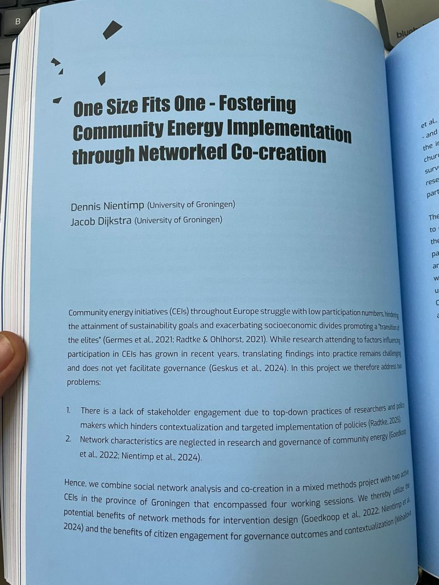

## NEF Breaking Barriers

I had the pleasure to join the scientific conference of the New Energy Forum at [**Entrance - Centre of Expertise Energy**](https://www.linkedin.com/company/entrance-centre-of-expertise-energy/). I was impressed by the work that the colleagues at [**Hanze**](https://www.linkedin.com/company/hanzehogeschool-groningen/) conduct and enjoyed the exchange of ideas.\
Next to that I gave a panel talk on a project in which [**Jacob Dijkstra**](https://www.linkedin.com/in/jacob-dijkstra-0b163352/) and I conducted learning communities with two community energy projects from the north of Groningen, which was supported by [**Groninger Energiekoepel**](https://www.linkedin.com/company/groninger-energiekoepel/) and funded by [**Nationaal Programma Groningen**](https://www.linkedin.com/company/nationaalprogrammagroningen/). In this project we combined co-creation with network analysis and together with initiators we devised contextualized mobilization strategies. A small piece on that can be found in the conference publication called “Breaking Barriers”.

