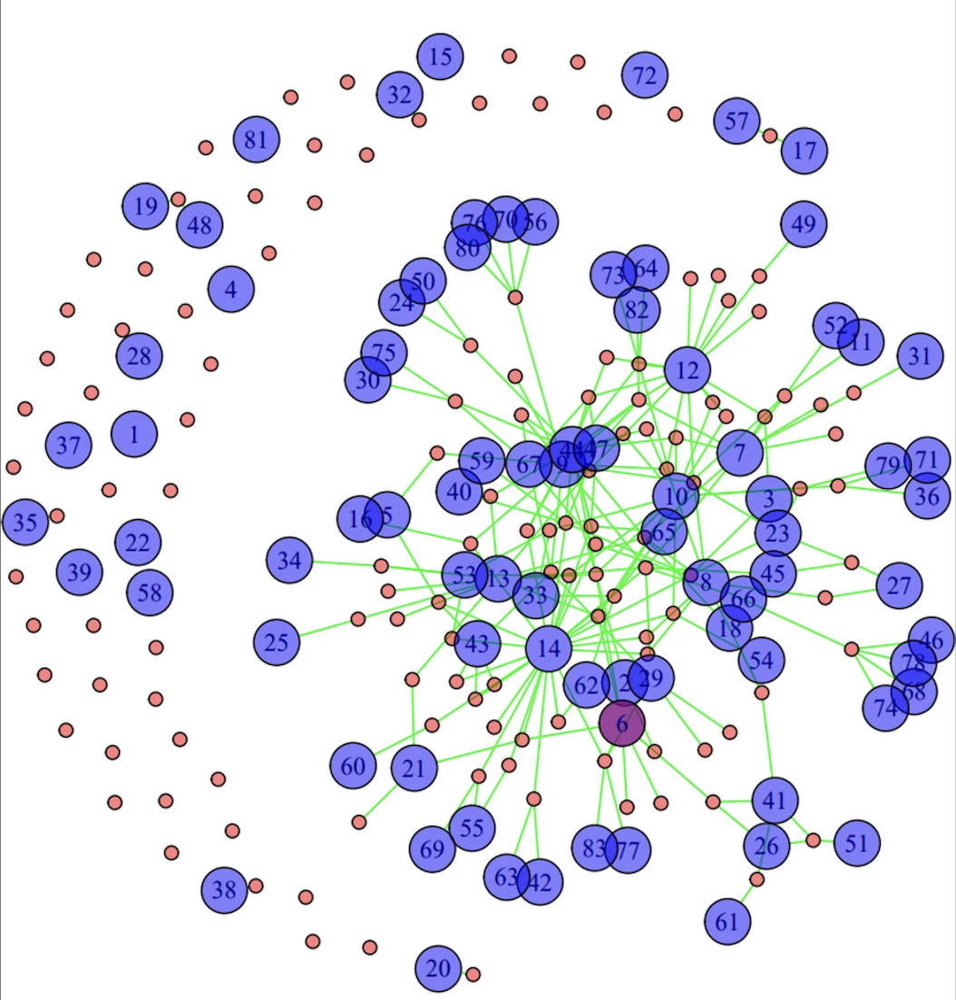
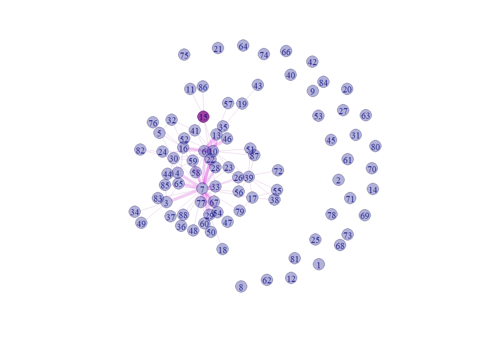

## A social network approach to community energy initiative participation

This publication explores how social network structures influence participation in community energy initiatives (CEIs). We argue that network characteristics shape who participates, how information spreads, and how inequalities in participation emerge.

```{=html}

     

```

**Published version:**\
[Click here to read the paper](https://doi.org/10.1007/s12053-024-10247-4)

## Abstract

This perspective paper argues how a social network approach can contribute to creating a more comprehensive picture of how individual and community characteristics influence participation in community energy initiatives (CEIs). We argue how social network theory and methods for social network analysis can be utilized to better understand participation. Further, we show how this can potentially aid the implementation of interventions aimed at attracting more participants with more diverse socio-demographic backgrounds. Importantly, we argue that the structure of community social networks connecting (potential) participants could importantly influence whether and how individual and community properties affect CEI participation. Our aim is conveying the social network approach to the field of community energy researchers and stakeholders who might not be familiar with it. We discuss empirical evidence on the effect of network characteristics on CEI participation and the connection between research on CEIs and adjacent fields as a foundation for our claims. We also illustrate how a social network approach might help to overcome biased participation and low participation numbers, by providing social scientists with a tool to give empirically grounded advice to CEIs. We conclude by looking at avenues for future research and discuss how the context of CEIs might yield new theoretical insights and hypotheses.

------------------------------------------------------------------------

## Citation

Nientimp, D., Goedkoop, F., Flache, A., & Dijkstra, J. (2024).\
*A social network approach to community energy initiative participation*.\
Energy Efficiency, 17, 66. <https://doi.org/10.1007/s12053-024-10247-4>
