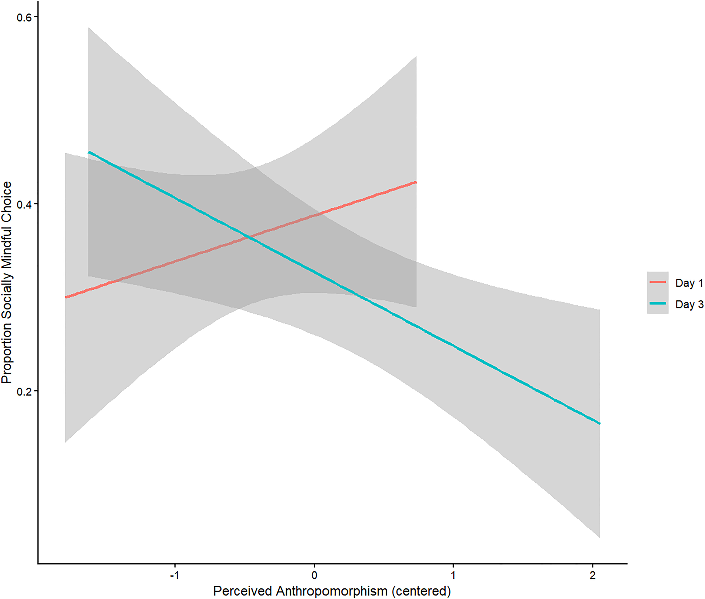

## 

One size fits all? Transferring social mindfulness measures to HRI

With colleagues from Radboud University we explored how humans react to and change their behavior in reaction to long. time interaction with social robots. Further we investigated the whether psychological measures can be transferred to the Human Robot context. Based on our results we advise caution and doing so.

```{=html}

```

**Published version:**\
[Click here to read the paper](https://doi.org/10.1371/journal.pone.0339959)

------------------------------------------------------------------------

## Abstract

Applying psychological measures to Human Robot Interaction (HRI) has become increasingly common. Among these, the Social Mindfulness Paradigm (SoMi)has been used to study social mindfulness towards robots through online experiments using vignettes. This line of work indicated that humans do not show prosocial behavior towards robots. However, these findings are potentially confounded in two ways: items in the SoMi task were based on human-human interactions (HHI), not HRI, and experiments did not involve real-life interactions with robots. Addressing these methodological shortcomings, the current studies investigated whether the SoMi task is a valid assessment of social mindfulness in HRI to determine under which conditions, if any, we observe prosocial behavior towards robots. In Study One, participants interacted with a social robot (Cozmo) for three days, with perceived anthropomorphism and social mindfulness assessed before and after the interaction period. In Study Two, participants played the classic version of the SoMi paradigm using revised items matched in value for humans and robots, based on prior evaluations by a separate sample. Prolonged interaction with Cozmo did not increase social mindfulness but increased anthropomorphic perception of the robot. The revised items did not increase social mindfulness in the anthropomorphic condition, but they increased overall social mindfulness compared with previous studies. We conclude that real-life interaction does not necessarily enhance social mindfulness towards robots, that the item selection and their value for both human and robots must be considered, and that future studies should explore other interaction time frames and items.. Further, the increase in perceived anthropomorphism after a period of real-life interaction supports theory on anthropomorphism as a dynamic process. More general, the results stress that the field should carefully test HHI measures to ensure measurement validity before transferring them to HRI and that researchers must consider the context in which HRI occurs for external validity. Our findings also raise new questions for theory on social mindfulness, and support the emerging critique of the widely used Computers Are Social Actors (CASA) theory, which lead to the emergence of psychological measures in the field of HRI.

------------------------------------------------------------------------

## Citation

Nientimp, Dennis, Barbara C. N. Müller, Sari R. R. Nijssen, and Evelien Heijselaar. 2026. ‘One Size Fits All? Transferring Social Mindfulness Measures to HRI’. *PLOS ONE* 21(1):e0339959. doi:[10.1371/journal.pone.0339959](https://doi.org/10.1371/journal.pone.0339959).
