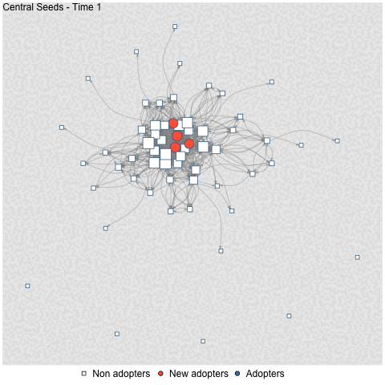

## Testing Seeding Strategies with Empirically Informed Diffusion Simulations in 11 Communities (Nientimp, Dijkstra & Flache; ongoing project)

Community Energy Initiatives (CEIs) can play a big role in the energy transition, but they often struggle because not enough people join or because participation is uneven. Since people’s decisions are strongly influenced by their social connections, we treat CEI participation as something that spreads through a community much like other social behaviors. Using detailed network and survey data from 11 communities in the northern Netherlands, we built a simulation model that shows how participation might spread depending on who gets involved first. The model uses people’s stated willingness to participate and the strength of their social ties to estimate how easily they might join. By testing different starting strategies—random people, highly connected “hubs,” or central people within smaller groups—we show that the structure of each community’s network and individual willingness levels largely determine how fast participation grows. Because these patterns differ widely between communities, our results suggest that one‑size‑fits‑all policies and subsidies may not work well for CEIs.

Figure 1:

```{=html}

     
<div style="height: 600px; margin-bottom: 2rem;">
  <iframe src="adoption_all_weighted_no_means.pdf"
          width="100%"
          height="100%"
          style="border: none;">
  </iframe>
</div>
```

*Note***.** Adoption outcomes for all communities. On the y axis the total proportion of adopters. The x axis is the simulation timeline. Each communities’ adoption lines are displayed in different colors and the seeding conditions in differently dotted lines. The three plots display the strong (Q1), medium (M) and weak (Q3) influence conditions, from left to right.

## Learning Communities: Networked Co-Creation to Fascilitate the Energy Transition in the North of Groningen (Nientimp & Dijkstra; under review).

Together with Groninger Energiekoepel [GrEK](https://grek.nl/), Jacob Dijkstra and I received a [PEP](https://pepg.nl/) (Programm Energie Participatie) grant to set up learning communities with community energy initiatives in the province of Groningen. The aim of the project was to develop dissemination strategies by bridging the gap between scientific insights and policy implementation which is a bottleneck to the successful implementation of community energy projects. In doing so we organized 4 participatory sessions with two active community energy initiatives (CEIs) in which initiators acted as co-researchers. During the sessions the initiators discussed the socio-econimic composition of their communities, their perceptions of community norms and values and insight of 9 earlier research projects on CEIs. They also mapped their local network structure.

Figure 2:

```{=html}

<div style="height: 600px; margin-bottom: 2rem;">
<iframe src="Figure_2.png"
        width="100%"
        height="100%"
        style="border: none;">
</iframe>
</div>
```

Note. Here is a picture of the network mapped by the initiators.

Next to that the research team collelcted survey data in the respective communities on perceived local network structures and psychological and motivational factors with regards to the energy transition.

Figure 3:

```{=html}

<div style="height: 600px; margin-bottom: 2rem;">
<iframe src="g_com_12_merged_engl.pdf"
        width="100%"
        height="100%"
        style="border: none;">
</iframe>
</div>
```

Note. The figure shows the local community networks as perceived by initiators (the CEI) in blue and the network as perceived by the survey respondents of their respective community in red. Both network perception are merged here and overlap is indicated by green ties.

This method not only enriched survey data with contextual insights of initiators, it also enabled the cross-validation of data generated by initiators and survey respondents. As such the insights formed a reliable basis for the design of contextualized dissemination strategies designed by initiators and researchers. A full research report is openly accessible and the insights point towards more stakeholder engagement in policy implementation and research and highlight the contextual nature of CEIs implying that a “one size fits all” approach is counterproductive.

## **Does central seeding backfire (Nientimp, Renzini & Flache; ongoing project) ?**

In this project dr. Francesco Renzini, prof. Andreas Flache and I are investigating the consequences of integrating empirically plausible social influence and tie-formation mechanisms into fractional diffusion models. First simulation outcomes suggest that common central seeding strategies might loose their advantage as soon as we add bounded confidence and tie-formation mechanisms. This might have large implications for the field of diffusion of innovation and and especially the research line on influence maximization that so far recommended to use central seeding in network interventions and policy.

Figure 4.

```{=html}
<embed src="pa_3d.html"
       type="text/html"
       width="150%"
       height="600px" />
```

Note. The graphs above show the three way interaction between three different mechanism implemented in the ABM.

## Using Network Methodologies to aid the Implementation of Community Energy Projects (Nientimp, Flache & Dijkstra; under review).

Community energy is meant to give everyone a fair chance to take part in the energy transition, yet many initiatives still struggle to attract enough people and often end up involving mostly well‑resourced citizens. This gap between EU "energy justice" ambitions and practice shows that current approaches to participation are not working as intended. A key reason is that current implementation approaches focus on individual characteristics and financial incentives, while they neglect social relational and network factors. Based on earlier rserarch that indicates the importance of social relationsal and network factors for CEI participation, our work shows that using social network insights can help community energy groups and policymakers to design smarter, more targeted outreach strategies that fit the social fabric of each community and ultimately support a more just and effective energy transition.

We utilize

1.  Descriptive network analysis to identify community member that are more likely to participate due to their individual characteristics and their connection to the initiative.

    ```{=html}
    <div style="height: 600px; margin-bottom: 2rem;">
      <iframe src="Fig_4.pdf"
            width="100%"
            height="100%"
            style="border: none;">
    </iframe>
    </div>
    ```

2.  Cluster Analysis to identify clusters and possible differences in socioeconomic factors between them that might hinder diffusion of participation in the local community.

    ```{=html}
    <div style="height: 600px; margin-bottom: 2rem;">
      <iframe src="Fig_7.pdf"
            width="100%"
            height="100%"
            style="border: none;">
    </iframe>
    </div>
    ```

3.  Empirically informed diffusion models to investigate the best targeting strategy for the case at hand.

```{=html}
<div style="height: 600px; margin-bottom: 2rem;">
  
```
